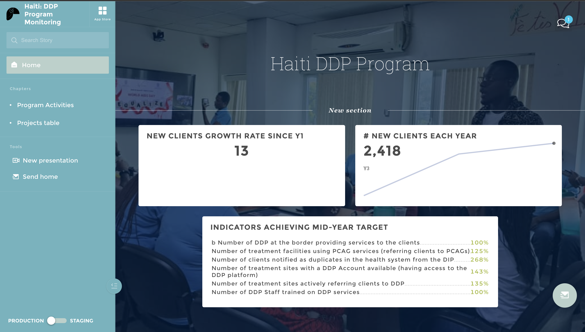
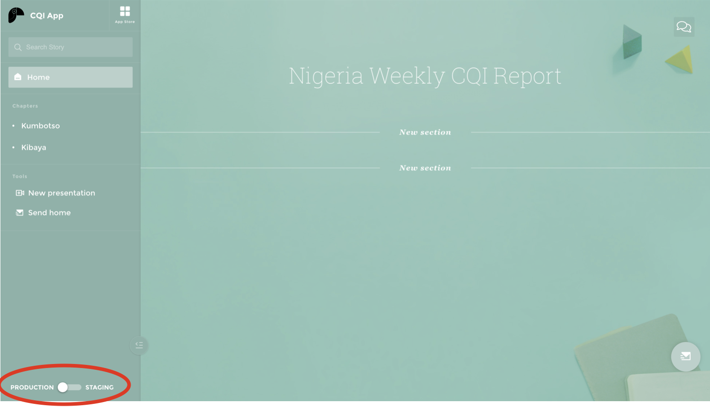
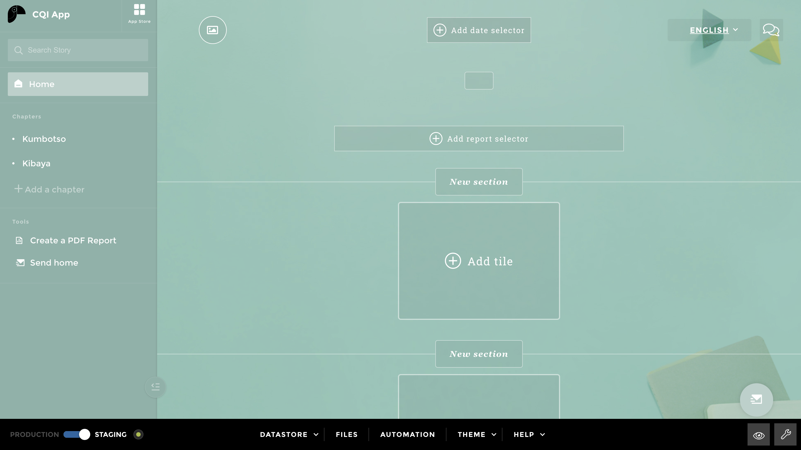
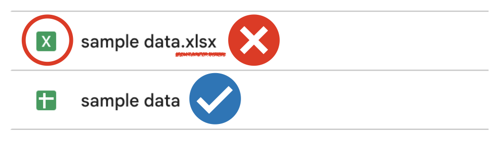
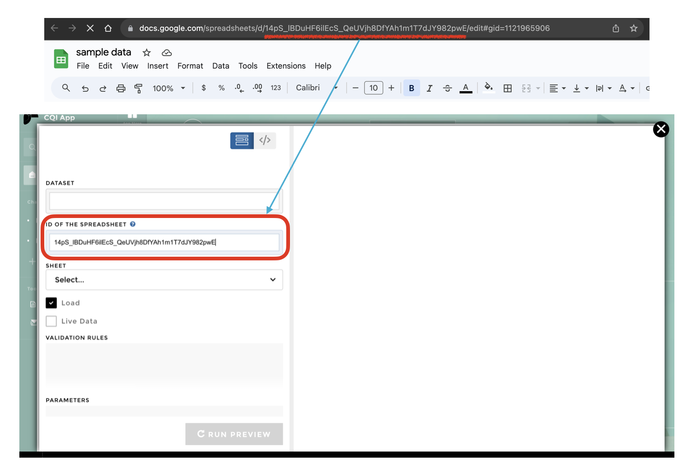
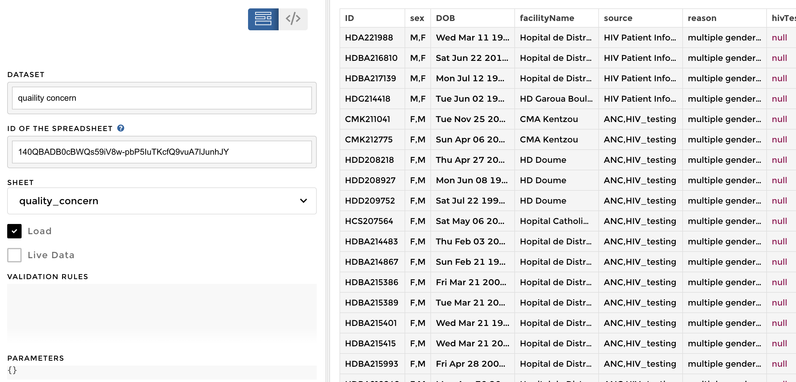
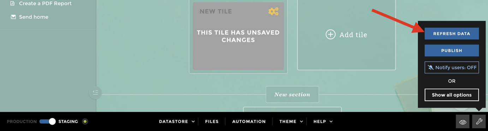
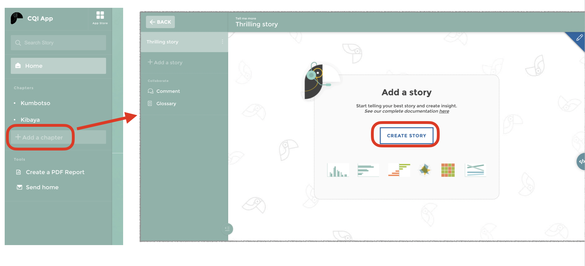
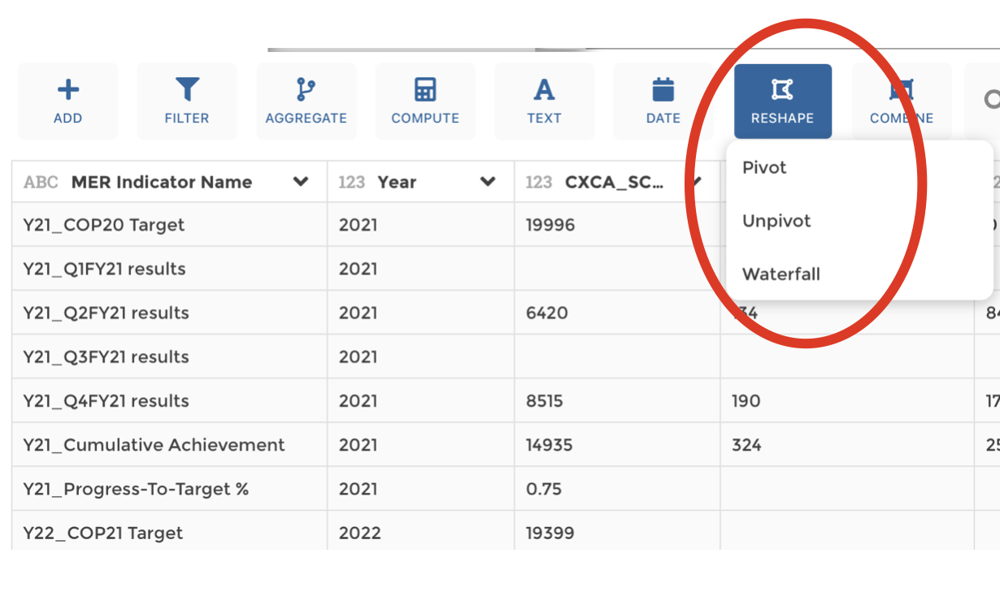
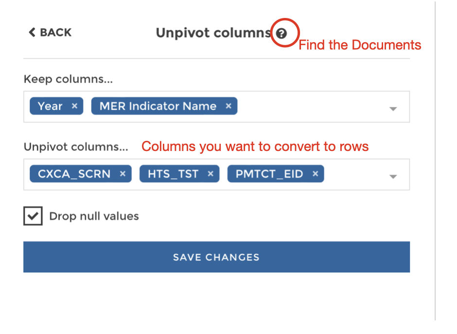

# Toucan Toco Tutorial 1 
## Introduction
Welcome to our tutorial on [Toucan Toco](https://www.toucantoco.com/en/), a powerful analytics platform known for its impressive data visualization and storytelling capabilities. This guide will walk you through creating a new application, connecting a Google Sheet dataset, and crafting a basic plot. Perfect for both seasoned analysts and newcomers, this tutorial is your step into the world of intuitive and engaging data presentation with Toucan Toco. 

We'll start by linking your Google Sheet data, move to some essential data processing, and conclude with creating a visually appealing plot. Ready to transform your data into a compelling visual story? Let’s begin!

*A sample homepage of an App*

## Step 1: Initiate Editing in a Toucan App
Consider each app in Toucan Toco as a miniature website, where the editing framework resembles creating a slide presentation. This approach allows you to structure your data story in an organized manner. You can create multiple chapters within your app, each capable of housing up to two plots per page. This structure helps in segmenting and presenting data in a coherent and engaging way.

To begin, we dive into a brand new app. The first step in the editing process involves activating the **staging** mode, which is crucial for editing your app without affecting the live version.

*Switch to staging mode using the bottom-left toggle, shifting from production to editing environment.*

Upon entering the staging mode, you’ll be greeted with an empty homepage. This blank canvas is where your data story begins to take shape.

*An empty homepage appears, ready for your creative input*

Toucan Toco offers a fixed layout, simplifying the design process. Your primary task here is to input a title that encapsulates the essence of your data story. This title acts as the first point of engagement for your audience, setting the tone for the insights and visualizations to follow.

In the next steps, we’ll delve into connecting your data source and starting to transform your data into captivating visual stories. 

## Step 2: Connect Google Sheet to Toucan
Connecting your data to Toucan Toco is a crucial step in bringing your data story to life. Toucan Toco offers a versatile range of connection options, accommodating common database servers like Amazon, Databricks, and Google Platform. In today's toturial, we choose google sheet as the example.

Let’s begin by preparing your data for visualization:

#### 1.Store and Format Data: 
Ensure your data is stored on Google Drive and formatted as a Google Sheet. This is essential because Toucan Toco requires the data to be in Google Sheet format for seamless integration.

*Remember: Data must be in Google Sheet format.*

#### 2.Accessing Connectors: 
On your Toucan Toco interface, locate the black toolbar at the bottom of your screen. Click on 'Data' to reveal three menu options. Then, select connectors and click on ADD A QUERY to initiate the data connection process.

#### 3.Entering Google Sheet ID: 
Next, you need to input the ID of your Google Sheet into the ID OF THE SPREADSHEET field. You can find this ID in the Google Sheet's URL; it's the alphanumeric string after "/d/". For instance, in the URL *https://docs.google.com/spreadsheets/d/toucan-toco-123432/edit#gid=12344567*, the ID is **toucan-toco-123432**.

#### 4.Previewing Data: 
After entering the Google Sheet ID, Toucan Toco allows you to preview your data. This step is crucial for verifying that the correct data set is loaded and formatted properly for your upcoming visualizations.
then you can preview the data 

With these steps, you have successfully connected your Google Sheet to Toucan Toco. You're now ready to process and visualize your data in a way that tells a compelling and insightful story.

#### 5.Refresh Data:
As you make updates to your Google Sheet, reflecting these changes in your Toucan Toco app is just a few clicks away.

Here’s how you can refresh your data:

1. _Accessing the Refresh Option_: On your Toucan Toco interface, look for the tool icon located in the bottom toolbar. This icon opens up various functional options.

2. _Initiate Data Refresh_: Click **REFRESH DATA**,and give the platform a few seconds to process the request. Shortly after, you should see that the data in your application has been updated to reflect the latest changes from your Google Sheet.

3. _==Tips==_: In some instances, the data may not update immediately after clicking the refresh button. If this occurs, **refresh your web page**. This action often resolves any minor glitches and ensures that your data is fully synchronized.

## Step 3: Prepare and Adjust for a Data Story 

Once your data is linked to Toucan Toco, the next step is to shape it into a compelling visual narrative. This involves several key actions designed to refine your data and make it suitable for storytelling through visualization.

#### 1. Start a new story: 
Start by selecting **Add a chapter** on the left side of the Toucan Toco interface. This will take you to a new page. There, click **CREATE STORY** in the center to begin.

You'll be taken to a story editing page:

Click the pencil icon to enter chart editing mode.

#### 2. Select your Data
On the chart editing page, you will see a list of datasets imported in Step 2.

Choose the dataset you wish to use for your plot. A preview of the selected dataset will be displayed.

If the dataset is correct, click 'validate'. If you need to choose a different dataset, click the pencil icon again to return to the dataset list.

#### 3. Edit Data
On reaching the data editing page in Toucan Toco, you're presented with a user-friendly interface showcasing your data and a variety of transformation tools. Toucan Toco's toolkit includes options for filtering, computation, aggregation, among others, allowing you to fine-tune your dataset for optimal visualization.
 

##### a. drop null value
A frequent and crucial step in data preprocessing is the removal of rows with null values in a specific column. Here's how to do it:

* Click on the **filter** function in the toolbar.
* Select **Filter rows**.
 
* Choose the is **not null option** in the filter operator.
 

##### b. Unpivot
To create a chart, you may need to reshape your dataset. Unpivot is a transformation that converts columns into rows, making your data suitable for certain types of visualizations.

Within the Reshape toolbox, Toucan Toco offers options like Pivot, Unpivot, and Waterfall. For unpivoting:

* Select **Unpivot**.

In the **Reshape** of the tool box, toucan provide 3 options: Pivot, Unpivot, and Waterfall. Unpivot can transform columns into rows. 

* Use the **Unpivot columns...** option to select the columns you wish to transform into rows.
* In the **Keep columns...** section, choose the columns you want to retain in their current form.
* For more detailed instructions, click the question mark to access the official documentation.

##### Tips for Organizing Data Operationsps
After applying multiple operations to your data, Toucan Toco allows you to manage these changes effectively:

* Rearrange the sequence of operations: Each operation you apply is presented as a block. You can reorder these blocks using the buttons on the right side of each block.
* Delete operations: If you need to remove an operation, simply click the circle on the left side of the block.

These functionalities ensure that your data transformation process is both efficient and adaptable, paving the way for creating compelling and accurate visualizations.

## Step 4: Let's create a plot
Creating a plot in Toucan Toco is an intuitive process, designed to be straightforward even for those new to data visualization. In this section, we'll work together to build a bar chart, a common and effective way to represent data visually.

Start by exploring the chart type options provided by Toucan Toco. Clicking the book icon will direct you to the official documentation and provide sample demos. On the right, you'll see a preview of your data and the evolving plot.

Building a Bar Chart

#### 1. Selecting Chart Type:
* Choose Bar Chart as your chart type.

#### 2. Setting Up Chart Axes:
* Assign your desired column to the **LABEL** field for the x-axis.
* Select the appropriate column for the **VALUE** field, which will represent the y-axis.
* The right side will display a preview of your bar chart.

#### 3. Adding Additional Components:
* You can enhance your chart with additional components like legends or sorting options.
  
* For grouping data, use a relevant column, such as 'year'.
Here's the result of these steps:

#### 4. Finalizing Your Story

Once you are satisfied with your bar chart, don't forget two crucial steps:

* **Save Changes**: Ensure all your hard work is preserved.

* **Publish**: Make your story available for viewing.

Congratulations! You've successfully created and shared your first story in Toucan Toco, showcasing your data in a visually compelling and informative way. This process illustrates the power of data visualization in turning complex datasets into understandable and engaging narratives.